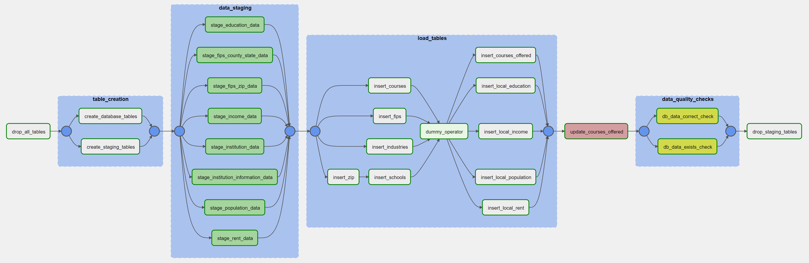
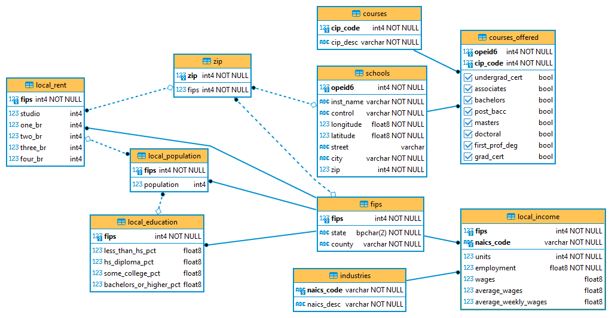

# Data Engineering Degree Capstone Project

---

Requirements:

  - Apache Airflow v2.2.4
  - PostgreSQL 13

## Project Write Up

#### Overview

The goal of this project was to create a 3NF, source of truth database for local economic and education information. This model was chosen to provide accurate and up-to-date information sourced from US government research and statistics. The data is hosted in a local PostgreSQL database instance and the ETL process is completed using a combination of Apache Airflow and standard Python/Pandas scripts to clean the data. The final database contains over 2.5M rows of data.

***NOTE:*** Unzip the contents of `./data/capstone-db/project-data.zip` into `./data/capstone-db` prior to running the DAG.

---

1. Identify project scope and goals.

  - This project underwent several iterations
    - Formula 1 data warehouse for statistical analysis
      - [The database already existed and was available in multiple formats](http://ergast.com/mrd/)
      - The database wouldn't have contained over 1M rows of data that would have been valuable
    - Reddit comment data warehouse to compare the rise and fall of `GME` to sentiment in the `r/wallstreetbets` subreddit
      - [I spent over a week developing various website and API scrapers to obtain data](https://github.com/tcamack/reddit_submission_scraper.git)
      - A conservative estimate places this data warehouse at 20M rows of data
      - The scope rapidly grew out of control
  - I settled on this project as the scope was within reason for the course, the data would still present challenges, and the data is important to many people
    - I obtained data from various sources, the majority of which are government organizations.
    - I cleaned the data using Pandas to remove unnecessary columns such. For instance, the `institution_data.csv` dataset contained over 28,000 columns, of which only ~20 were not redacted in the original dataset for privacy reasons.
    - I created the data pipelines based on the cleaned datasets. If the datasets weren't cleaned prior to being inserted into staging tables I would have been inserting over 8GB of data, of which only ~200MB was relevant to the project.
    - I used DBeaver to create my first ERD.

---

2. Clearly state the rationale for the choice of tools and technologies for the project.

  I chose to use Apache Airflow as it's an industry standard tool that I want to have as much experience with as possible. In this case Apache Airflow provides toolset to automate updating the information in the database as new information is made available annually. As it stands the database has over 2.5M rows of data.

---

3. Propose how often the data should be updated and why.

  Almost all of the project data is obtained from US government annual reports and the majority of the reports are released in Q4 every calendar year. The database should be updated, at a minimum, once per year in either Q1 or Q4.

---

4. Final questions and thoughts.

  If the data were to be increased by 100x I would have used Spark as opposed to a traditional DBMS. I would still use Apache Airflow to automate execution. If the pipeline were run on a daily basis I wouldn't have to change much of anything. The pipeline runs in less then 5 minutes due to the cleaning I did beforehand and any semi-modern machine should be able to handle the ETL regularly. If the database needed to be accessed by 100+ people it still wouldn't change much. It's using PostgreSQL, which is an ACID DBMS. As a result any further pipelines going to or from the database should be able to be handled. If performance became an issue I would consider moving the database to the cloud. Depending on the use cases by the 100+ people I would also consider creating a data warehouse for analytic purposes that would pull data from the database.

  If the US government ever releases reports more frequently then once per year I'd make the pipeline run more often. It's more than possible for other data to be added to the database, for instance I added population data after everything else was finalized including the entire ETL process. The new data may be updated more frequently then once per year and in that case the ETL pipeline could be run more frequently.

  Finally, I'd likely remove the entire `drop_all_tables` operator if deploying this in a production environment depending on business requirements.

## Entity Relationship Diagram

#### Project goals

- Create a source-of-truth database
- Find viable and accurate data sources
- Merge data from various sources
- Use Apache Airflow to create a PostgreSQL ETL pipeline

#### This project practiced the following concepts:
- Data collection and cleaning with Pandas
- 3NF data modeling with PostgreSQL
- ETL pipeline creation with Apache Airflow

#### Data sources
- [Educational attainment by county](https://www.ers.usda.gov/data-products/county-level-data-sets/download-data/)
- [Employment industry and wages by county](https://www.statsamerica.org/downloads/default.aspx)
  - [Individual state and county data available from the U.S. BEA](https://www.bea.gov/data/income-saving/personal-income-county-metro-and-other-areas)
- [Fair market rents](https://www.huduser.gov/portal/datasets/fmr.html)
- [Fips - counties - states](https://github.com/kjhealy/fips-codes/blob/master/state_and_county_fips_master.csv)
  - [Data can be verified with a USDA webpage](https://www.nrcs.usda.gov/wps/portal/nrcs/detail/national/home/?cid=nrcs143_013697)
- [Fips - zip crosswalk](https://www.huduser.gov/portal/datasets/usps_crosswalk.html)
- [Population estimates by county](https://www.ers.usda.gov/data-products/county-level-data-sets/download-data/)
- [Postsecondary institution locations](https://catalog.data.gov/dataset/postsecondary-school-locations-current)
- [Postsecondary institutions](https://collegescorecard.ed.gov/data/)

---

## Project Instructions

#### Overview

The purpose of the data engineering capstone project is to give you a chance to combine what you've learned throughout the program. This project will be an important part of your portfolio that will help you achieve your data engineering-related career goals.

In this project, you can choose to complete the project provided for you, or define the scope and data for a project of your own design. Either way, you'll be expected to go through the same steps outlined below.

###### Udacity Provided Project
In the Udacity provided project, you'll work with four datasets to complete the project. The main dataset will include data on immigration to the United States, and supplementary datasets will include data on airport codes, U.S. city demographics, and temperature data. You're also welcome to enrich the project with additional data if you'd like to set your project apart.

###### Open-Ended Project

If you decide to design your own project, you can find useful information in the Project Resources section. Rather than go through steps below with the data Udacity provides, you'll gather your own data, and go through the same process.

#### Instructions

To help guide your project, we've broken it down into a series of steps.

###### Step 1: Scope the Project and Gather Data
Since the scope of the project will be highly dependent on the data, these two things happen simultaneously. In this step, you’ll:

- Identify and gather the data you'll be using for your project (at least two sources and more than 1 million rows). See Project Resources for ideas of what data you can use.
- Explain what end use cases you'd like to prepare the data for (e.g., analytics table, app back-end, source-of-truth database, etc.)

###### Step 2: Explore and Assess the Data

- Explore the data to identify data quality issues, like missing values, duplicate data, etc.
- Document steps necessary to clean the data

###### Step 3: Define the Data Model

- Map out the conceptual data model and explain why you chose that model
- List the steps necessary to pipeline the data into the chosen data model

###### Step 4: Run ETL to Model the Data

- Create the data pipelines and the data model
- Include a data dictionary
- Run data quality checks to ensure the pipeline ran as expected
  - Integrity constraints on the relational database (e.g., unique key, data type, etc.)
  - Unit tests for the scripts to ensure they are doing the right thing
  - Source/count checks to ensure completeness

###### Step 5: Complete Project Write Up

- What's the goal? What queries will you want to run? How would Spark or Airflow be incorporated? Why did you choose the model you chose?
- Clearly state the rationale for the choice of tools and technologies for the project.
- Document the steps of the process.
- Propose how often the data should be updated and why.
- Post your write-up and final data model in a GitHub repo.
- Include a description of how you would approach the problem differently under the following scenarios:
  - If the data was increased by 100x.
  - If the pipelines were run on a daily basis by 7am.
  - If the database needed to be accessed by 100+ people.
